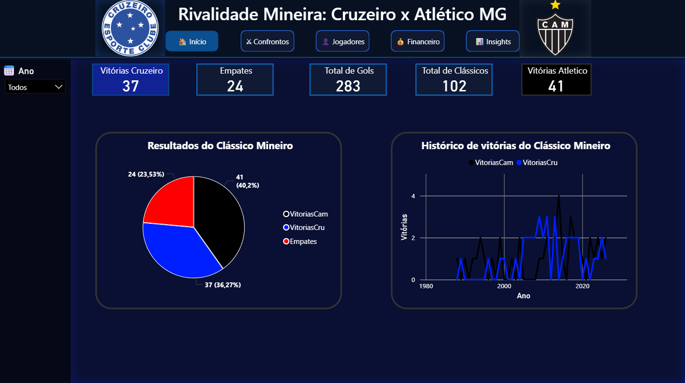
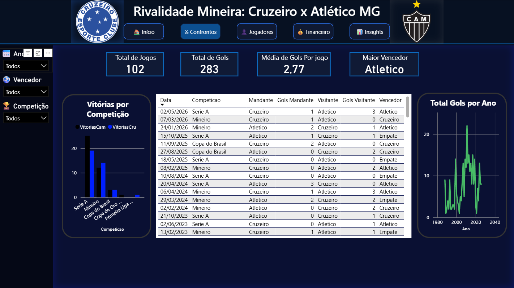
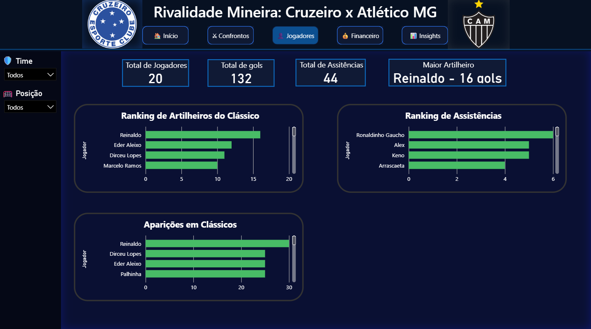
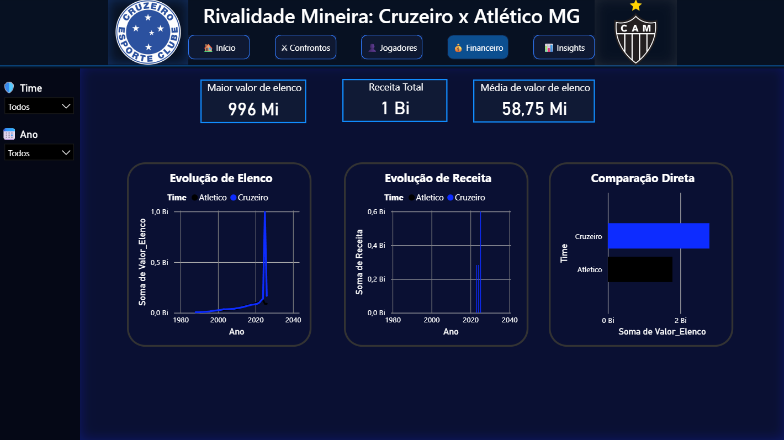
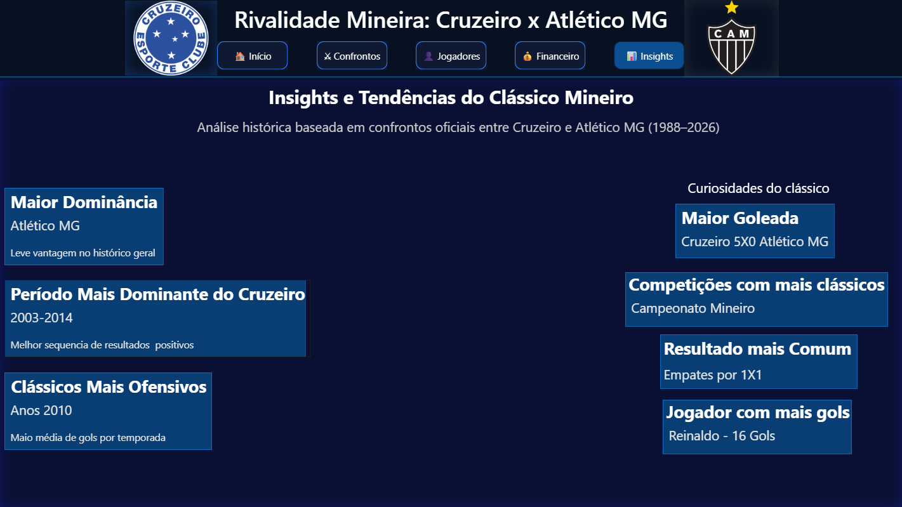

# CruXCam Dashboard ⚽📊

Dashboard interativo desenvolvido em **Power BI** para análise histórica da rivalidade entre **Cruzeiro x Atlético-MG**.  
O projeto explora dados de partidas, jogadores, estatísticas históricas e informações financeiras, entregando uma visualização moderna, interativa e profissional sobre um dos maiores clássicos do futebol brasileiro.

---

## 📂 Estrutura do Projeto
- `CruXCam_Partidas.csv` → Dados históricos das partidas (Data, Competição, Mandante, Visitante, Gols e Vencedor).
- `CruXCam_Jogadores.csv` → Estatísticas individuais dos jogadores (Gols, Assistências e Jogos em clássicos).
- `CruXCam_Financeiro.csv` → Informações financeiras dos clubes (Valor de elenco e receitas por temporada).
- `CruXCam.pbix` → Arquivo principal do Power BI contendo modelagem, medidas DAX e visualizações interativas.

---

## 🧠 Módulos do Dashboard
1. **Modelagem de Dados** → Relacionamentos entre tabelas e organização estrutural do projeto.
2. **Medidas DAX** → KPIs como Total de Jogos, Vitórias, Empates, Média de Gols e Estatísticas Históricas.
3. **Visualizações Interativas** → Cartões, gráficos de linha, rosca, barras e painéis analíticos.
4. **Filtros Dinâmicos** → Segmentação por Ano, Competição, Time e Jogadores.
5. **Análises Históricas** → Insights sobre domínio histórico, períodos mais ofensivos e maiores artilheiros.
6. **Design Profissional** → Interface moderna inspirada nas cores do Cruzeiro, utilizando tons de azul e fundo escuro.

---

## 🎨 Páginas do Dashboard

### 🏠 Página Inicial
- KPIs principais da rivalidade
- Histórico de vitórias
- Total de gols e confrontos
- Evolução temporal do clássico mineiro

### ⚔ Página Confrontos
- Histórico completo das partidas
- Filtros por competição, vencedor e ano
- Média de gols
- Análise de desempenho em diferentes campeonatos

### 👤 Página Jogadores
- Ranking de artilheiros
- Ranking de assistências
- Jogadores com mais aparições
- Destaque automático do maior artilheiro

### 💰 Página Financeiro
- Evolução do valor de elenco
- Comparação financeira entre os clubes
- Receitas históricas
- Crescimento econômico ao longo das temporadas

### 📈 Página Insights
- Tendências históricas do clássico
- Curiosidades da rivalidade
- Períodos dominantes
- Resultados mais comuns
- Análises descritivas executivas

---

## 🧰 Tecnologias Utilizadas
- Power BI Desktop
- DAX (Data Analysis Expressions)
- Power Query
- CSV (dados estruturados)
- GitHub para versionamento e portfólio

---

## 🎯 Objetivo do Projeto
Este projeto foi desenvolvido com foco em:
- Prática de análise de dados
- Desenvolvimento de dashboards profissionais
- Aprendizado em Power BI
- Construção de portfólio para área de Dados
- Aplicação de storytelling visual em dashboards esportivos

---

## 📌 Destaques do Projeto
✅ Dashboard totalmente interativo  
✅ Visual moderno e responsivo  
✅ Navegação entre páginas  
✅ KPIs automáticos com DAX  
✅ Análises históricas e financeiras  
✅ Storytelling visual aplicado ao esporte  

---
## 📷 Preview
### 🏠 Página Inicial

### ⚔️ Página Confrontos

### 👤 Página Jogadores

### 💰 Página Financeiro

### 📈 Página Insights

## ▶ Como Utilizar

1. Faça o download do arquivo `.pbix`
2. Abra utilizando o Power BI Desktop
3. Atualize as fontes CSV caso necessário

## 🚀 Autor
Projeto desenvolvido por **Diego Rocha** como prática de análise de dados e construção de portfólio em Power BI.
